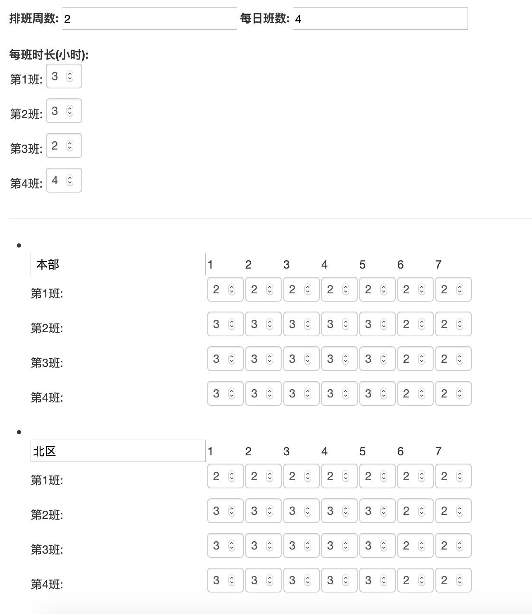

# 排班软件管理员操作
> 万俊鹏 
> 联系邮箱: jpwan21@gmail.com

#### A.介绍
##### 登录：118.89.101.128 或者 wy.jpwan.online
##### 级别：管理员、中高层经理、员工、被限制员工。其中被限制员工是往届员工或者被限制排班的员工
#### B 导入通讯录
##### 排班系统通过导入通讯录更新名单，通讯录格式需要作如下调整
* 通讯录最后一行留为备注
* 导入时，将两位内务复制到两位经理前面 （原因如下：前两位同学默认权限是管理员，往后13位同学权限为中高层，所以导入名单时当心把自己的管理员权限弄没了）
* 
* 提示上传通讯录成功后，就说明成功了。（可以查看员工信息检查），可以查看员工信息和权限检查
* 目前修改员工权限及添加删除员工只能通过“导入通讯录”，其他按钮是没用的
* 注意：
  + 学号要避免空格 
  + 不在通讯录上的同学会自动限制排班权限

#### C 选班定制
##### 定制顺序：
* 设置排班周数和每日班数（期末为6,4 平常为2,4）
* 依次设置每班时长（如3，3，2，4）
* 设置每个周的名字（如：本部，北区，本部(1.1-1.7)）
* 设置每班的人数（按照文印实际情况填写）
* 点击提交设置
* 每次定制后，之前选班的信息会被清空

##### 目前文印当班情况按下图定制，一般情况下不需要改动。(如果周数变多，如期末班，排班系统能正常选班，系统排班模块还有bug)

##### 期末班设定顺序
* 第一周本部
* 第一周北区
* 第二周本部
* 第二周北区
* 第三周本部
* 第三周北区

##### 平常班设定顺序 
* 本部
* 北区

#### D 排班操作
* 初始化排班： 清空之前选班信息
* 排班：排班
* 重开选班：排班后，会关闭选班，这个按钮可以把选班重新打开
* 生成csv文件：可以生成当班表，可用excel打开，之后可以用这个文件编辑

